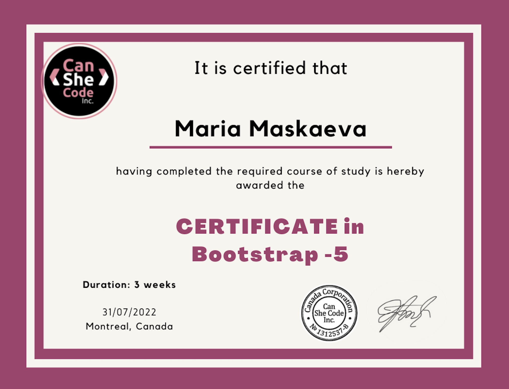

# MARIA MASKAEVA
### Front-end Developer                                 

## CONTACTS
* ☎️ +375297066277                 
* 📧 maria.maskaeva98@yandex.ru    
* 🤯 Maria_Maskaeva#1747
* 🤝 [LinkedIn](https://www.linkedin.com/in/maria-maskaeva-16389b73/)

## PROFILE 
After 10 years in logistics I've learnt how to work under pressure, with strict deadlines and active team cooperation.
After 10 years as a mother I've understood how to learn and move fast and what is more - how to adapt to a fast-changing surrounding.
After 6 months as an account executive I seem to understand the US and EU customers with all their needs and worries.

## SKILLS
* HTML5/CSS3
* JavaScript Basics
* Bootstrap 5.2
* GitHub
* Flexible Box Layout
* Responsive layouts
* API Basics

## LANGUAGES

* English - Advanced (C1)
* German - Pre-intermediate (B1)
* Polish - Elementary (A1)
* Russian - Native

## CODE EXAMPLE 

###### Will be replaced by a Codewars example in a while

## EDUCATION
### CanSheCode Inc, Montreal, Canada
* April - June 2022 - Introduction to Web Development (HTML5, CSS3)

* July 2022 - Bootstrap 5

* August 2022 - till now - JavaScript Basics

### Minsk State Linguistic University
PR, English and German Interpreter

## WORK EXPERIENCE

1. April - October 2021 
    + Company:_Syberry CIS_
    + Responsibilities:
        - communicate with EU and US customers;
        - find out their expectations from a custom software they want us to build;
        - pitch the company's presentation;
        - prepare the proposal with the team of developers;
        - pitch the proposal presentation;
        - answer the questions and discuss the contract;

2. June 2010 - February 2021
    + Company: _APS.The Solver_
    + Responsibilities:
        - outcoming cold calls and communication with the possible customers;
        - transportation details and peculiarities discussion;
        - contruct conduct and transport documentation preparation;
        - trouble-shooting and risk management on the way;
        - payment control;
        - business trips;

